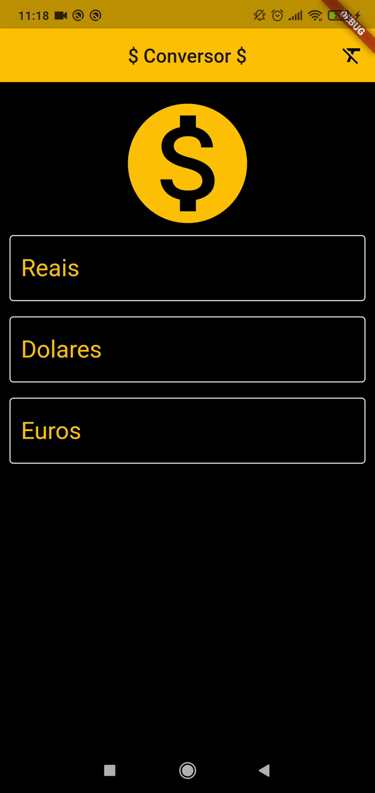

# Currency converter

Olá, este é um projeto em flutter de um conversor de moedas, sendo elas, real, euro e dólar !

Este projeto foi realizado consultando os dados da api da [HG Finance](https://hgbrasil.com/status/finance), para recuperar a cotação do dólar, euro e real.

  

## Screenshots
<table>

<tr>
<td></td>
</tr>

</table>
